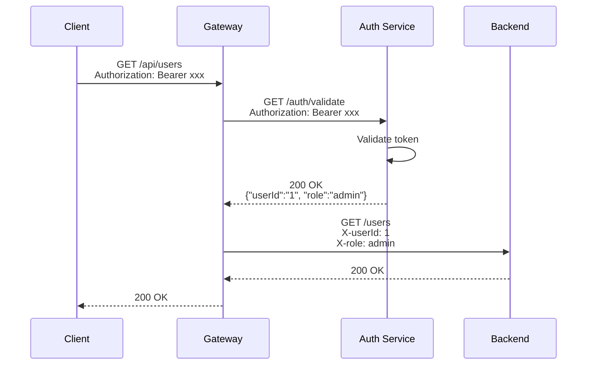

# Auth Delegation

Delegate token validation to your own auth service. This lets you use **any auth strategy** — RS256, OAuth2, API keys, sessions, or anything else.

## Configuration

```yaml
config:
  auth:
    authService: localhost:5000
    authPath: /auth/validate
    defaultProtected: true
```

When `authService` is configured, the gateway calls your service instead of validating locally. The `secret` field is ignored.

## How It Works



## Auth Service Contract

Your auth service must implement a single endpoint.

### Request

```
GET /auth/validate
Authorization: Bearer <token>
```

The gateway forwards the exact `Authorization` header from the original client request.

### Success Response (200 OK)

Return a JSON object with user claims. String values are forwarded as `X-` headers:

```json
{
  "userId": "123",
  "username": "alice",
  "role": "admin"
}
```

Results in: `X-userId: 123`, `X-username: alice`, `X-role: admin`.

Returning an empty body or `{}` is valid — the request is forwarded without extra headers.

### Error Response (any non-200)

The gateway forwards your service's response directly to the client:

```json
HTTP/1.1 401 Unauthorized

{
  "error": "Token expired",
  "success": false
}
```

### Service Unavailable

If your auth service is unreachable, the gateway returns `503 Service Unavailable` with a 5-second timeout.

## Example: Go

```go
package main

import (
    "encoding/json"
    "net/http"
    "strings"
    "time"

    "github.com/golang-jwt/jwt/v5"
)

const secret = "your-secret-key"

func main() {
    http.HandleFunc("/auth/validate", validateHandler)
    http.HandleFunc("/auth/login", loginHandler)
    http.HandleFunc("/auth/register", registerHandler)
    http.ListenAndServe(":5000", nil)
}

func validateHandler(w http.ResponseWriter, r *http.Request) {
    auth := r.Header.Get("Authorization")
    parts := strings.Split(auth, " ")
    if len(parts) != 2 {
        http.Error(w, `{"error":"missing token"}`, 401)
        return
    }

    token, err := jwt.Parse(parts[1], func(t *jwt.Token) (interface{}, error) {
        return []byte(secret), nil
    })
    if err != nil || !token.Valid {
        http.Error(w, `{"error":"invalid token"}`, 401)
        return
    }

    claims := token.Claims.(jwt.MapClaims)
    w.Header().Set("Content-Type", "application/json")
    json.NewEncoder(w).Encode(map[string]string{
        "userId":   claims["sub"].(string),
        "username": claims["username"].(string),
        "role":     claims["role"].(string),
    })
}

func loginHandler(w http.ResponseWriter, r *http.Request) {
    // Your login logic — validate credentials, return JWT
    token := jwt.NewWithClaims(jwt.SigningMethodHS256, jwt.MapClaims{
        "sub":      "1",
        "username": "alice",
        "role":     "admin",
        "exp":      time.Now().Add(24 * time.Hour).Unix(),
    })
    tokenString, _ := token.SignedString([]byte(secret))

    w.Header().Set("Content-Type", "application/json")
    json.NewEncoder(w).Encode(map[string]string{"token": tokenString})
}

func registerHandler(w http.ResponseWriter, r *http.Request) {
    // Your registration logic
    w.Header().Set("Content-Type", "application/json")
    json.NewEncoder(w).Encode(map[string]string{"message": "User registered"})
}
```

## Example: Node.js

```javascript
const express = require('express');
const jwt = require('jsonwebtoken');
const app = express();

const SECRET = 'your-secret-key';

app.get('/auth/validate', (req, res) => {
  const token = req.headers.authorization?.split(' ')[1];
  if (!token) return res.status(401).json({ error: 'Missing token' });

  try {
    const decoded = jwt.verify(token, SECRET);
    res.json({
      userId: decoded.sub,
      username: decoded.username,
      role: decoded.role,
    });
  } catch (err) {
    res.status(401).json({ error: 'Invalid token' });
  }
});

app.post('/auth/login', express.json(), (req, res) => {
  // Your login logic
  const token = jwt.sign(
    { sub: '1', username: 'alice', role: 'admin' },
    SECRET,
    { expiresIn: '24h' }
  );
  res.json({ token });
});

app.listen(5000, () => console.log('Auth service on :5000'));
```
