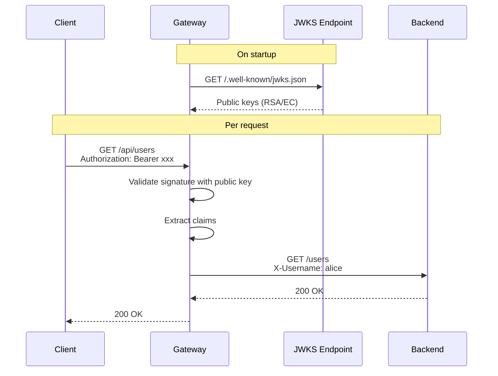

# JWT with RS256 / JWKS

Validate JWT tokens using asymmetric algorithms (RS256, ES256, etc.) via a remote JWKS (JSON Web Key Set) endpoint. This is the standard for identity providers like Auth0, Keycloak, Firebase, AWS Cognito, and Okta.

## Configuration

```yaml
config:
  auth:
    jwksUrl: "https://your-provider.com/.well-known/jwks.json"
    defaultProtected: true
```

That's it. The gateway fetches the JWKS on startup and uses it to validate token signatures. No shared secret needed.

## How It Works



1. On startup, the gateway fetches public keys from the JWKS URL
2. For each request, validates the token signature using the matching key (by `kid` header)
3. Extracts claims and forwards them as `X-` headers
4. Supports key rotation — the gateway handles `kid` matching automatically

## Supported Algorithms

| Algorithm | Type | Use Case |
|-----------|------|----------|
| RS256 | RSA | Most common, Auth0/Keycloak default |
| RS384 | RSA | Higher security RSA |
| RS512 | RSA | Maximum security RSA |
| ES256 | ECDSA | Compact keys, modern providers |
| ES384 | ECDSA | Higher security ECDSA |
| ES512 | ECDSA | Maximum security ECDSA |

## Provider Examples

### Auth0

```yaml
auth:
  jwksUrl: "https://YOUR_DOMAIN.auth0.com/.well-known/jwks.json"
  defaultProtected: true
```

### Keycloak

```yaml
auth:
  jwksUrl: "https://keycloak.example.com/realms/YOUR_REALM/protocol/openid-connect/certs"
  defaultProtected: true
```

### Firebase

```yaml
auth:
  jwksUrl: "https://www.googleapis.com/service_accounts/v1/jwk/securetoken@system.gserviceaccount.com"
  defaultProtected: true
```

### AWS Cognito

```yaml
auth:
  jwksUrl: "https://cognito-idp.REGION.amazonaws.com/POOL_ID/.well-known/jwks.json"
  defaultProtected: true
```

## Issuer and Audience Validation

Same as local JWT — use request headers to trigger validation:

| Header | Validates |
|--------|-----------|
| `X-JWT-Issuer` | Checks the `iss` claim |
| `X-JWT-Audience` | Checks the `aud` claim |

## Auth Mode Priority

If multiple auth options are configured, Tainha uses this priority:

1. **Auth Delegation** (`authService`) — highest priority
2. **JWKS** (`jwksUrl`) — used if no authService
3. **Local HS256** (`secret`) — fallback

This means you can set both `secret` (for development) and `jwksUrl` (for production) — JWKS takes precedence.
