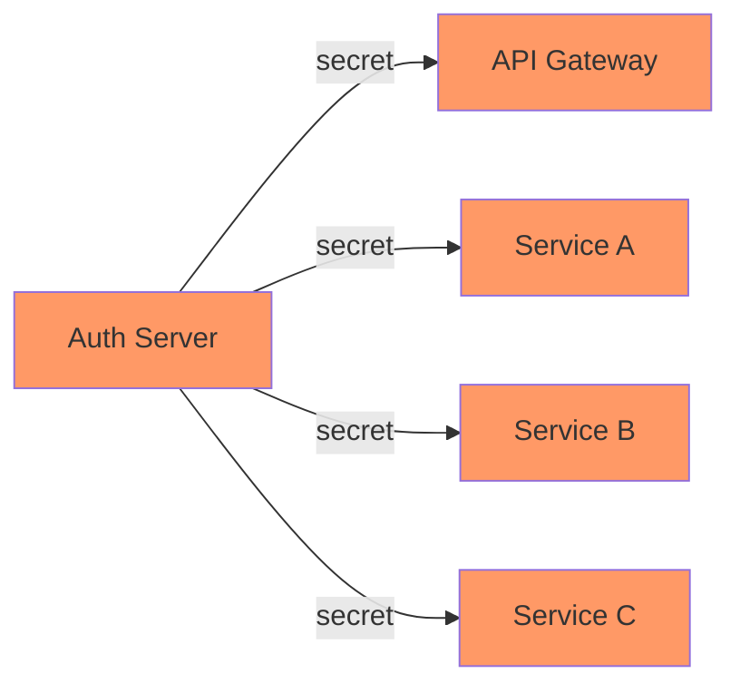
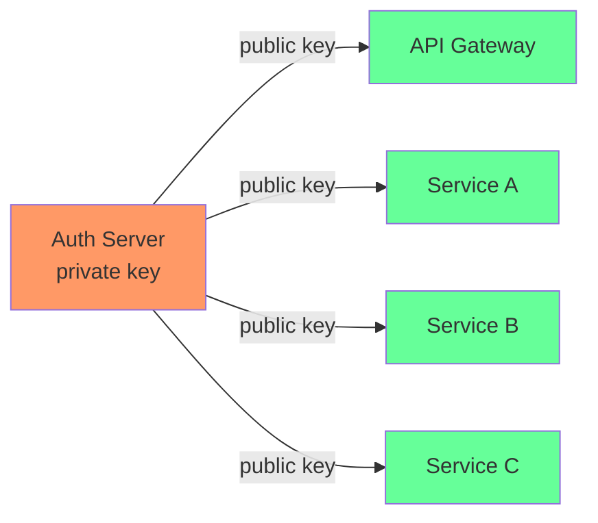
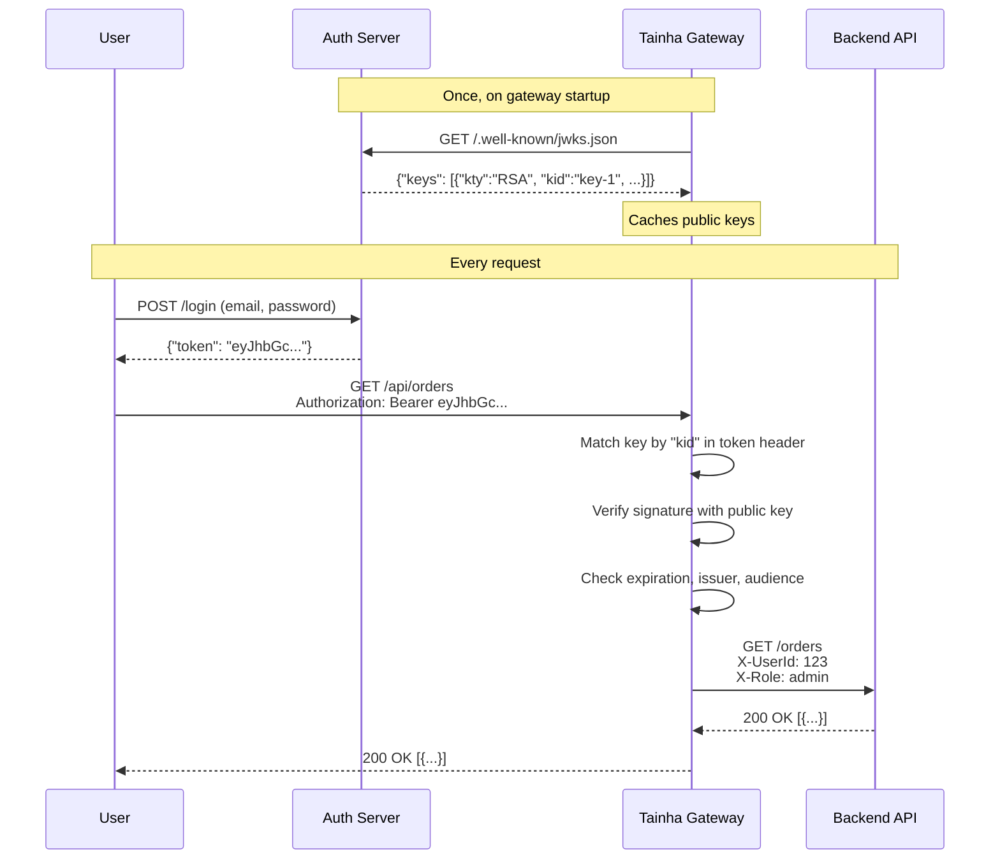

# JWKS (JSON Web Key Set)

## What is JWKS?

JWKS is a standard way to publish **public keys** that can verify JWT tokens. Instead of sharing a secret between services (like HS256), the service that **creates** the token keeps a private key, and publishes the public key at a well-known URL. Anyone can validate the token without ever knowing the private key.

Think of it like a digital signature:
- **Private key** (kept secret) — signs the token
- **Public key** (published openly) — verifies the signature is authentic

The JWKS endpoint is a JSON file containing one or more public keys, typically available at:

```
https://your-provider.com/.well-known/jwks.json
```

## Why use JWKS instead of a shared secret?

With HS256 (shared secret), every service that needs to validate tokens must know the same secret. This creates problems:



**Problems with shared secrets:**
- If **any** service is compromised, the attacker can forge tokens for **all** services
- You need to distribute and rotate the secret across every service
- Any service with the secret can create tokens, not just the auth server

With JWKS, only the auth server has the private key:



**Advantages:**
- **No shared secrets** — public keys can be exposed safely
- **Only the auth server can create tokens** — compromising a service doesn't let attackers forge tokens
- **Key rotation** — publish a new key, old tokens still validate with the old key until they expire
- **Industry standard** — Auth0, Keycloak, Firebase, AWS Cognito, Okta, Azure AD all use JWKS

## How does JWKS work in the API Gateway?

The gateway sits between your clients and backends. With JWKS, it validates tokens **without calling the auth server on every request** — it just uses the cached public keys.



**The key point:** the gateway **never calls the auth server per request**. It fetched the keys once and validates tokens locally. This is faster than auth delegation and more secure than shared secrets.

## What does this mean for your backend?

Your backend services **don't need to know anything about JWT**. The gateway validates the token and forwards user information as simple HTTP headers:

```
X-UserId: 123
X-Username: alice
X-Role: admin
X-Email: alice@example.com
```

Your backend just reads these headers — it could be written in any language, any framework. It doesn't need JWT libraries, doesn't need the public key, doesn't need to call the auth server.

## When should you use JWKS?

| Scenario | Recommendation |
|----------|---------------|
| Using Auth0, Keycloak, Firebase, Cognito, or Okta | **Use JWKS** — it's how these providers are designed to work |
| Multiple services need to validate tokens | **Use JWKS** — no secret distribution needed |
| Building a production system | **Use JWKS** — more secure than shared secrets |
| Quick prototype or local development | Use [HS256](/docs/authentication/local-jwt) — simpler to set up |
| Custom auth logic (sessions, API keys, OAuth) | Use [Auth Delegation](/docs/authentication/delegation) — full control |

## Configuration

```yaml
config:
  auth:
    jwksUrl: "https://your-provider.com/.well-known/jwks.json"
    defaultProtected: true
```

That's it. The gateway fetches the keys on startup and validates every token automatically.

## Provider Examples

### Auth0

```yaml
auth:
  jwksUrl: "https://YOUR_DOMAIN.auth0.com/.well-known/jwks.json"
```

### Keycloak

```yaml
auth:
  jwksUrl: "https://keycloak.example.com/realms/YOUR_REALM/protocol/openid-connect/certs"
```

### Firebase

```yaml
auth:
  jwksUrl: "https://www.googleapis.com/service_accounts/v1/jwk/securetoken@system.gserviceaccount.com"
```

### AWS Cognito

```yaml
auth:
  jwksUrl: "https://cognito-idp.REGION.amazonaws.com/POOL_ID/.well-known/jwks.json"
```

### Azure AD

```yaml
auth:
  jwksUrl: "https://login.microsoftonline.com/TENANT_ID/discovery/v2.0/keys"
```

## Supported Algorithms

| Algorithm | Type | Notes |
|-----------|------|-------|
| RS256 | RSA | Most common default |
| RS384, RS512 | RSA | Higher security |
| ES256 | ECDSA | Smaller keys, faster verification |
| ES384, ES512 | ECDSA | Higher security ECDSA |

The gateway auto-detects the algorithm from the JWKS — no need to configure it manually.

## Key Rotation

When your identity provider rotates keys:

1. New keys are published at the JWKS URL with a new `kid` (key ID)
2. New tokens are signed with the new key
3. The gateway matches each token's `kid` header to the correct public key
4. Old tokens continue to validate until they expire

No gateway restart needed. No config change needed.

## Issuer and Audience Validation

Optionally validate the `iss` and `aud` claims by sending headers in the request:

| Header | Validates |
|--------|-----------|
| `X-JWT-Issuer` | Token's `iss` claim must match |
| `X-JWT-Audience` | Token's `aud` claim must match |

These headers are removed before forwarding to the backend.

## Auth Mode Priority

If multiple auth options are configured, Tainha uses this priority:

1. **Auth Delegation** (`authService`) — highest priority
2. **JWKS** (`jwksUrl`)
3. **Local HS256** (`secret`) — fallback

You can set `secret` for local development and `jwksUrl` for production — JWKS takes precedence when both are present.
