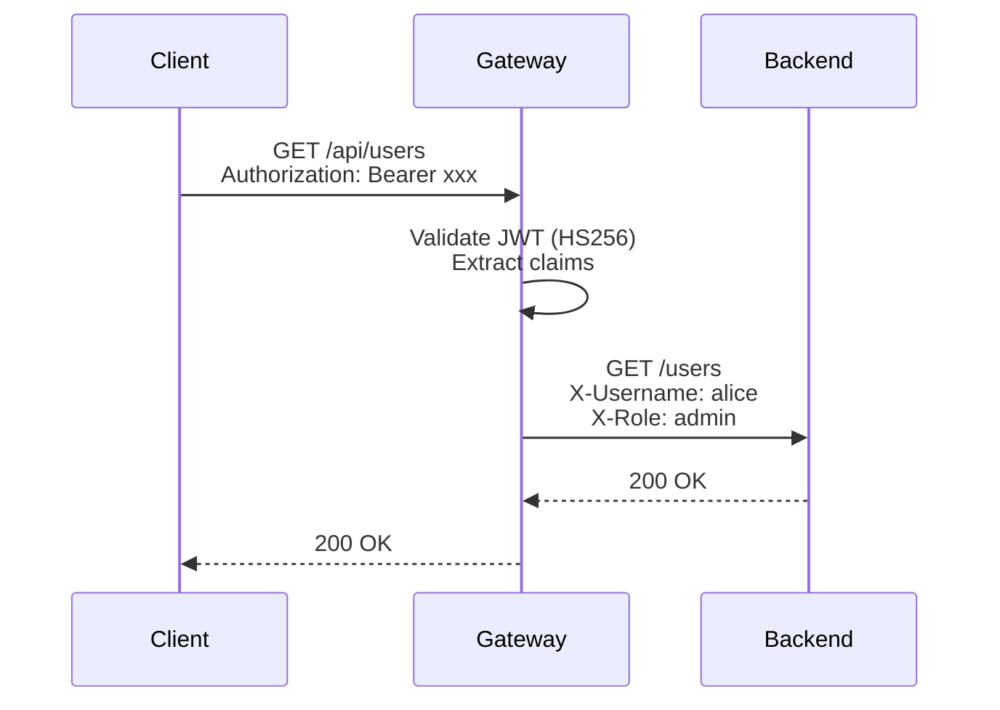

# Local JWT Validation

The simplest setup. The gateway validates JWT tokens using a shared HMAC secret — no external service needed.

## Configuration

```yaml
config:
  auth:
    secret: "your-secret-key"
    defaultProtected: true
```

## How It Works



1. Client sends `Authorization: Bearer <token>`
2. Gateway validates the token signature with the configured secret (HS256)
3. Gateway extracts string claims and forwards them as `X-` headers
4. Backend receives the request with claim headers

## Issuer and Audience Validation

You can optionally validate the `iss` and `aud` claims by sending extra headers in the request:

| Header | Validates |
|--------|-----------|
| `X-JWT-Issuer` | Checks the `iss` claim matches |
| `X-JWT-Audience` | Checks the `aud` claim matches |

These headers are removed before forwarding to the backend.

## Limitations

- Only supports **HS256** (HMAC with SHA-256)
- Requires the same secret on the gateway and the token issuer
- No support for RS256, JWK, or other asymmetric algorithms

If you need more flexibility, use [Auth Delegation](/docs/authentication/delegation) instead.
