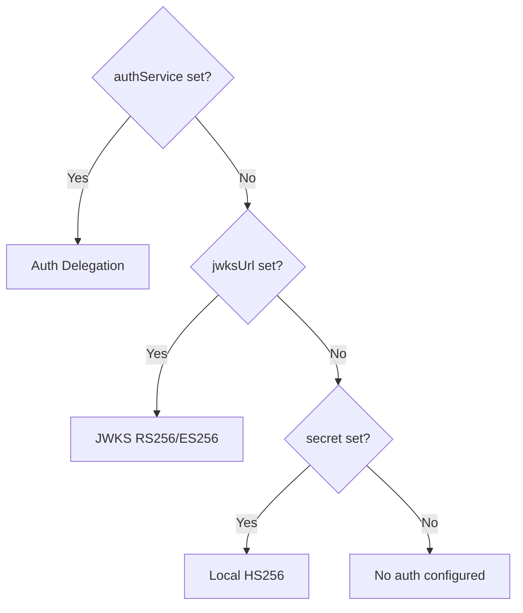

# Auth Configuration

Configure how the gateway validates JWT tokens on protected routes.

## Options

```yaml
config:
  auth:
    secret: "your-hs256-secret"
    jwksUrl: "https://provider.com/.well-known/jwks.json"
    algorithm: RS256
    defaultProtected: true
    authService: localhost:5000
    authPath: /auth/validate
```

| Field | Type | Default | Description |
|-------|------|---------|-------------|
| `secret` | string | — | Shared secret for [HS256 validation](/docs/authentication/local-jwt) |
| `jwksUrl` | string | — | JWKS endpoint for [RS256/ES256 validation](/docs/authentication/jwks) |
| `algorithm` | string | — | Algorithm hint (optional) |
| `defaultProtected` | bool | `false` | Require auth on all routes by default |
| `authService` | string | — | Host for [auth delegation](/docs/authentication/delegation) |
| `authPath` | string | `/validate` | Endpoint path on the auth service |

## Three Modes

Tainha supports three auth modes. If multiple are configured, this priority applies:



| Mode | Config | Best for |
|------|--------|----------|
| [Local JWT](/docs/authentication/local-jwt) | `secret` | Prototyping, simple apps |
| [JWKS](/docs/authentication/jwks) | `jwksUrl` | Auth0, Keycloak, Firebase, Cognito |
| [Delegation](/docs/authentication/delegation) | `authService` | Custom auth logic, any strategy |

## Default Protected

When `defaultProtected: true`, **all routes require authentication** unless marked `public: true`:

```yaml
config:
  auth:
    secret: "my-secret"
    defaultProtected: true

routes:
  - method: GET
    route: /products
    public: true          # ← No auth needed

  - method: GET
    route: /orders        # ← Auth required (default)
```

When `defaultProtected: false` (the default), routes are public unless you add auth middleware yourself.

## Validation

The gateway fails fast on startup if:

- `defaultProtected: true` but none of `secret`, `jwksUrl`, or `authService` is set
- Both `authService` and `jwksUrl` are set (only one is used — `authService` wins)
