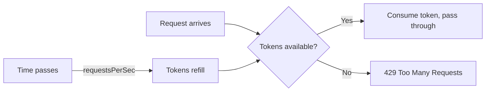

# Rate Limiting Configuration

Protect your backend services from abuse with per-IP rate limiting.

## Options

```yaml
config:
  rateLimit:
    enabled: true
    requestsPerSec: 100
    burst: 200
```

| Field | Type | Default | Description |
|-------|------|---------|-------------|
| `enabled` | bool | `false` | Enable rate limiting |
| `requestsPerSec` | int | `100` | Sustained request rate per IP |
| `burst` | int | `requestsPerSec * 2` | Maximum burst above the sustained rate |

## How It Works

The rate limiter uses a **token bucket** algorithm per client IP:



- Each IP starts with `burst` tokens
- Each request consumes 1 token
- Tokens refill at `requestsPerSec` rate
- When tokens are empty → `429 Too Many Requests`

## Burst vs Sustained Rate

**`requestsPerSec`** is the sustained rate — how many requests per second an IP can make continuously.

**`burst`** is the spike allowance — how many requests can come in at once before being throttled.

Example: `requestsPerSec: 10, burst: 50`
- A client can send 50 requests instantly (burst)
- After that, they can send 10 per second (sustained)
- If they stop for 5 seconds, they accumulate 50 tokens again

## Client IP Detection

The rate limiter identifies clients by IP address:

1. Checks `X-Forwarded-For` header (first IP in the chain)
2. Falls back to the connection's remote address

This works correctly behind load balancers and reverse proxies that set `X-Forwarded-For`.

## Response

When rate limited, the gateway returns:

```
HTTP/1.1 429 Too Many Requests
Content-Type: application/json
Retry-After: 1

{"error": "rate limit exceeded", "success": false}
```

The `Retry-After` header tells the client when to try again.

## Monitoring

With [telemetry](/docs/configuration/telemetry) enabled, rate limit hits are tracked as a Prometheus metric:

```promql
rate(http_server_rate_limit_hits_total[5m])
```

## Tips

- Start with generous limits and tighten based on real traffic
- Set `burst` to at least `2x requestsPerSec` to absorb natural traffic spikes
- The rate limiter state is **per gateway instance** — not shared across instances
- Health check (`/health`) and metrics (`/metrics`) endpoints are not rate limited
