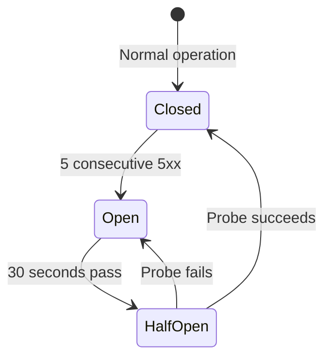

# Resilience Configuration

Configure circuit breaker and mapping cache to keep your gateway stable.

## Circuit Breaker

Prevents cascading failures when a backend goes down. Instead of every request waiting for a timeout, the circuit breaker rejects requests immediately after detecting failures.

```yaml
config:
  circuitBreaker:
    enabled: true
    maxFailures: 5
    timeoutSec: 30
    halfOpenRequests: 1
```

| Field | Type | Default | Description |
|-------|------|---------|-------------|
| `enabled` | bool | `false` | Enable circuit breaker |
| `maxFailures` | int | `5` | Consecutive 5xx responses before opening |
| `timeoutSec` | int | `30` | Seconds before testing recovery (half-open) |
| `halfOpenRequests` | int | `1` | Probe requests allowed in half-open state |

### State Machine



| State | What happens |
|-------|-------------|
| **Closed** | All requests pass through normally |
| **Open** | All requests immediately return `503 Service Unavailable` |
| **Half-Open** | 1 probe request allowed — if it succeeds, circuit closes; if it fails, circuit reopens |

### Per-Service Isolation

Each backend service has its own circuit. If `product-service` goes down, requests to `user-service` are unaffected.

### When to Use

- You have backends that occasionally go down or become slow
- You want to fail fast instead of accumulating timeouts
- You want to give failing backends time to recover without being hammered

See [Resilience](/docs/resilience) for more details.

## Mapping Cache

Caches responses from [response mapping](/docs/response-mapping) requests. Avoids fetching the same data repeatedly.

```yaml
config:
  mappingCache:
    enabled: true
    ttlSec: 60
    maxSize: 1000
```

| Field | Type | Default | Description |
|-------|------|---------|-------------|
| `enabled` | bool | `false` | Enable mapping cache |
| `ttlSec` | int | `60` | Seconds before a cached entry expires |
| `maxSize` | int | `1000` | Max entries in cache (LRU eviction when full) |

### How It Helps

Without cache — 100 products with 5 categories = **100 HTTP calls** to the categories service:

```
Product 1 → GET /categories?id=c1
Product 2 → GET /categories?id=c1  (same!)
Product 3 → GET /categories?id=c2
Product 4 → GET /categories?id=c1  (same!)
...
```

With cache — only **5 HTTP calls** (one per unique category):

```
Product 1 → GET /categories?id=c1  → cached
Product 2 → cache hit for c1       → instant
Product 3 → GET /categories?id=c2  → cached
Product 4 → cache hit for c1       → instant
...
```

### TTL

`ttlSec` controls how long cached data is valid. After expiry, the next request fetches fresh data.

- **Low TTL (5-30s)** — data stays fresh, more HTTP calls
- **High TTL (60-300s)** — fewer HTTP calls, data may be stale
- Choose based on how often your mapped data changes

### When to Use

- Mapping targets return data that doesn't change often (categories, configs, user profiles)
- Routes with many items that share the same mapped resources
- You want to reduce load on downstream services
