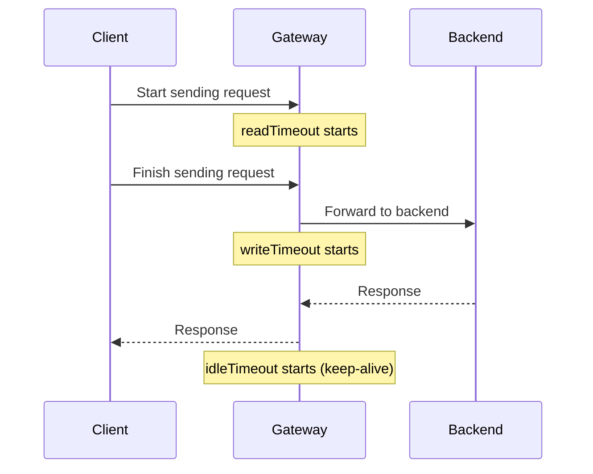

# Server Configuration

Basic gateway settings: port, base path, and timeouts.

## Options

```yaml
config:
  port: 8000
  basePath: /api
  readTimeoutSec: 15
  writeTimeoutSec: 30
  idleTimeoutSec: 60
```

| Field | Type | Default | Description |
|-------|------|---------|-------------|
| `port` | int | `8080` | Port the gateway listens on |
| `basePath` | string | `/api` | Prefix prepended to all route paths |
| `readTimeoutSec` | int | `15` | Max seconds to read the full request (headers + body) |
| `writeTimeoutSec` | int | `30` | Max seconds to write the response |
| `idleTimeoutSec` | int | `60` | Max seconds for idle keep-alive connections |

## Base Path

All routes are prefixed with `basePath`. If your config has:

```yaml
config:
  basePath: /api

routes:
  - route: /users
```

The client hits `/api/users`, not `/users`.

To serve routes at the root, set `basePath: ""`.

## Timeouts

Timeouts prevent slow clients or unresponsive backends from holding connections indefinitely.



**`readTimeoutSec`** — Protects against slow clients that send headers/body slowly (e.g., slowloris attacks). If the full request isn't read within this time, the connection is closed.

**`writeTimeoutSec`** — Covers the time from finishing reading the request to finishing writing the response. This includes backend proxy time + mapping time. Set this higher than your slowest backend + mapping combination.

**`idleTimeoutSec`** — How long a keep-alive connection can sit idle before being closed. Lower values free resources faster; higher values reduce TCP connection overhead for frequent clients.

## Graceful Shutdown

On `SIGTERM` or `SIGINT`:

1. Gateway stops accepting new connections
2. In-flight requests get up to 15 seconds to complete
3. Clean shutdown

This works automatically — no configuration needed.
