# Telemetry Configuration

Enable OpenTelemetry traces and Prometheus metrics for full visibility into your gateway.

## Options

```yaml
config:
  telemetry:
    enabled: true
    serviceName: tainha-gateway
    exporterEndpoint: localhost:4317
```

| Field | Type | Default | Description |
|-------|------|---------|-------------|
| `enabled` | bool | `false` | Enable metrics + traces |
| `serviceName` | string | `tainha-gateway` | Service name in OTEL and Prometheus |
| `exporterEndpoint` | string | — | OTLP gRPC endpoint for trace export |

## What You Get

When `enabled: true`:

### `GET /metrics` — Prometheus Endpoint

Exposes metrics in Prometheus format:

| Metric | Type | Description |
|--------|------|-------------|
| `http.server.request.count` | Counter | Requests by method, route, status |
| `http.server.request.duration` | Histogram | Latency in seconds |
| `http.server.active_requests` | UpDownCounter | In-flight requests |
| `http.server.rate_limit.hits` | Counter | Rate-limited requests |

### OTLP Traces

If `exporterEndpoint` is set, traces are exported via OTLP gRPC to Jaeger, Grafana Tempo, or any OTLP-compatible backend.

Each request creates a trace with child spans:

```mermaid
gantt
    title Request trace
    dateFormat X
    axisFormat %L ms

    section Gateway
    GET /api/products          :0, 25
    section Proxy
    → product-service          :2, 10
    section Mapper
    → /categories?id=c1        :12, 18
    → /categories?id=c2        :12, 20
```



### Structured Logs

All gateway logs are JSON via `slog`, including request IDs for correlation:

```json
{"time":"2025-01-15T10:30:00Z","level":"INFO","msg":"request received","path":"/api/products","method":"GET","requestId":"a1b2c3d4"}
```

## Zero Overhead When Disabled

When `enabled: false` (default):
- No metrics middleware is registered
- No `/metrics` endpoint
- No trace spans are created
- No OTLP connection is established

See [Observability](/docs/observability) for Prometheus scrape config, Grafana queries, and Jaeger setup.
