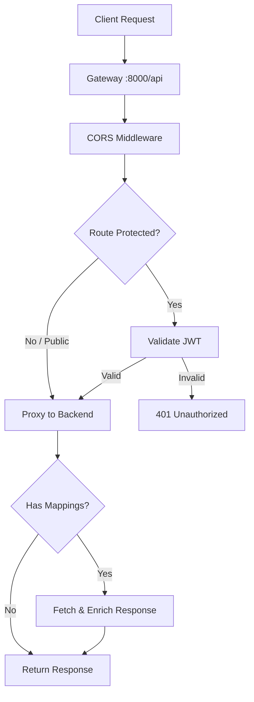

# Getting Started

Tainha is a lightweight API Gateway written in Go. It sits between your clients and backend services, handling routing, authentication, response mapping, and SSE streaming — all configured through a single YAML file.

## Installation

### From source

```bash
git clone https://github.com/lusqua/tainha-gateway.git
cd tainha-gateway
go build -o tainha ./cmd/gateway
```

### With Docker

```bash
docker build -t tainha-gateway -f e2e/Dockerfile .
```

## Quick Start

### 1. Create a config file

Create `config/config.yaml`:

```yaml
config:
  port: 8000
  basePath: /api
  auth:
    secret: "your-secret-key"
    defaultProtected: false

routes:
  - method: GET
    route: /users
    service: localhost:3000
    path: /users
    public: true
```

### 2. Start a backend service

For testing, you can use [json-server](https://github.com/typicode/json-server):

```bash
echo '{"users": [{"id": 1, "name": "Alice"}]}' > db.json
npx json-server --watch db.json --port 3000
```

### 3. Run the gateway

```bash
./tainha
# or
go run cmd/gateway/main.go
```

### 4. Test it

```bash
curl http://localhost:8000/api/users
# [{"id": 1, "name": "Alice"}]
```

The gateway is now proxying requests from `:8000/api/users` to your backend at `:3000/users`.

## How It Works



## Next Steps

- [Configuration Reference](./configuration) — full YAML options
- [Authentication](./authentication) — JWT validation and auth delegation
- [Response Mapping](./response-mapping) — enrich responses from multiple services
- [SSE Support](./sse) — real-time event streaming
