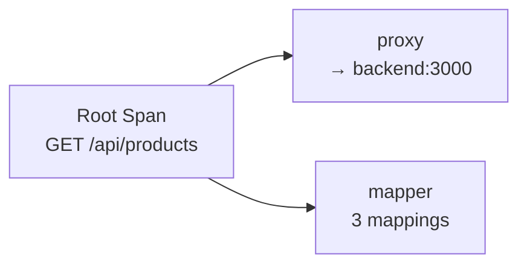

# Observability

Tainha has built-in OpenTelemetry support for **traces** and **metrics**, giving you full visibility into your gateway in production.

## Configuration

```yaml
config:
  telemetry:
    enabled: true
    serviceName: tainha-gateway
    exporterEndpoint: localhost:4317  # OTLP gRPC (Jaeger, Grafana Tempo, etc.)
```

| Field | Default | Description |
|-------|---------|-------------|
| `enabled` | `false` | Enable telemetry (metrics + traces) |
| `serviceName` | `tainha-gateway` | Service name in traces and metrics |
| `exporterEndpoint` | — | OTLP gRPC endpoint for trace export |

When `enabled: true`, the gateway exposes a `GET /metrics` endpoint in Prometheus format and exports traces via OTLP gRPC.

## Metrics

The `/metrics` endpoint exposes Prometheus-compatible metrics:

| Metric | Type | Description |
|--------|------|-------------|
| `http.server.request.count` | Counter | Total requests by method, route, status |
| `http.server.request.duration` | Histogram | Request latency in seconds |
| `http.server.active_requests` | UpDownCounter | In-flight request count |
| `http.server.rate_limit.hits` | Counter | Rate-limited requests by IP |

### Prometheus Scrape Config

```yaml
scrape_configs:
  - job_name: 'tainha-gateway'
    scrape_interval: 15s
    static_configs:
      - targets: ['localhost:8000']
    metrics_path: /metrics
```

### Example Grafana Queries

```promql
# Request rate per route
rate(http_server_request_count_total[5m])

# P95 latency
histogram_quantile(0.95, rate(http_server_request_duration_bucket[5m]))

# Error rate
sum(rate(http_server_request_count_total{http_status_code=~"5.."}[5m]))
/ sum(rate(http_server_request_count_total[5m]))

# Rate limit hits
rate(http_server_rate_limit_hits_total[5m])
```

## Traces

Every request creates a trace with child spans:



### Span Attributes

**Root span:**
- `http.method` — GET, POST, etc.
- `http.route` — gateway route pattern
- `http.target` — actual requested path

**Proxy span:**
- `peer.service` — backend host
- `http.url` — full backend URL

**Mapper span:**
- `mapping.count` — number of mapping rules

### Trace Propagation

The gateway propagates W3C Trace Context (`traceparent` / `tracestate` headers) to backend services. If your backends are also instrumented with OTEL, traces will connect across services automatically.

## Quick Setup with Jaeger

Run Jaeger locally to see traces:

```bash
docker run -d --name jaeger \
  -p 16686:16686 \
  -p 4317:4317 \
  jaegertracing/all-in-one:latest
```

Configure the gateway:

```yaml
config:
  telemetry:
    enabled: true
    serviceName: tainha-gateway
    exporterEndpoint: localhost:4317
```

Open `http://localhost:16686` to view traces.

## Quick Setup with Grafana Stack

For metrics + traces with Grafana, Prometheus, and Tempo:

```yaml
# docker-compose.yml
services:
  prometheus:
    image: prom/prometheus
    volumes:
      - ./prometheus.yml:/etc/prometheus/prometheus.yml
    ports:
      - "9090:9090"

  tempo:
    image: grafana/tempo
    command: ["-config.file=/etc/tempo.yaml"]
    ports:
      - "4317:4317"

  grafana:
    image: grafana/grafana
    ports:
      - "3000:3000"
    environment:
      - GF_AUTH_ANONYMOUS_ENABLED=true
```

## Request ID

Every request gets an `X-Request-ID` header (auto-generated or preserved from client). This ID appears in:
- Response headers
- Structured JSON logs
- Can be correlated with trace IDs for debugging

## Structured Logs

All logs are JSON-formatted via `slog`:

```json
{
  "time": "2025-01-15T10:30:00Z",
  "level": "INFO",
  "msg": "request received",
  "path": "/api/products",
  "method": "GET",
  "requestId": "a1b2c3d4e5f6"
}
```
