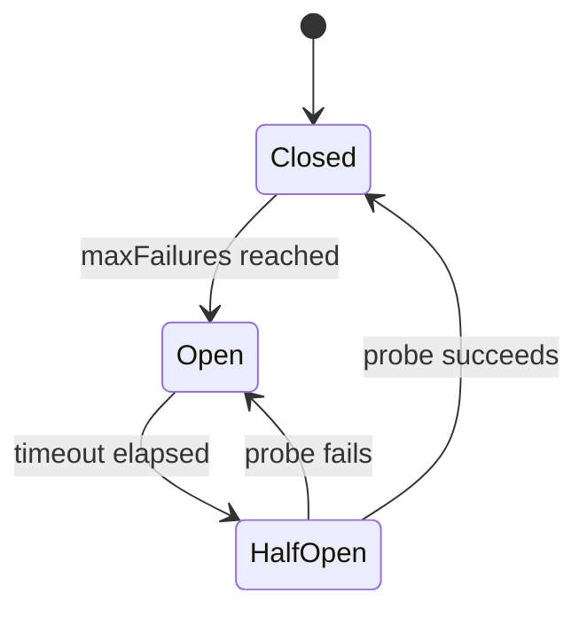
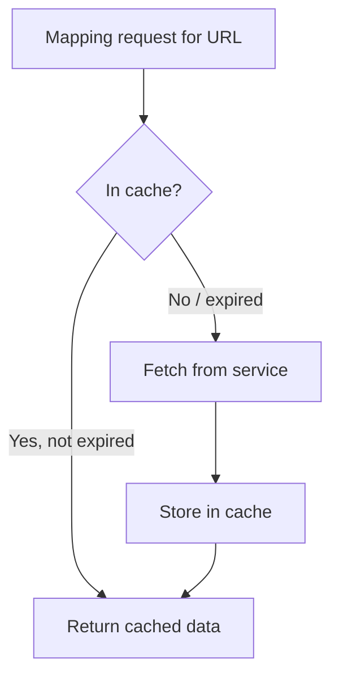

# Resilience

Tainha includes built-in features to keep your gateway stable under failure conditions.

## Circuit Breaker

Prevents cascading failures when a backend service goes down. Instead of waiting for timeouts on every request, the circuit breaker detects failures and rejects requests immediately.

### How It Works



| State | Behavior |
|-------|----------|
| **Closed** | Normal operation, requests pass through |
| **Open** | Requests rejected with 503 immediately |
| **Half-Open** | Allows N probe requests to test recovery |

### Configuration

```yaml
config:
  circuitBreaker:
    enabled: true
    maxFailures: 5        # 5xx responses before opening
    timeoutSec: 30        # Seconds before trying half-open
    halfOpenRequests: 1   # Probe requests to test recovery
```

### Per-Service Isolation

Each backend service has its own circuit. If `service-A` goes down, requests to `service-B` are unaffected.

## Mapping Cache

Caches responses from mapping requests to avoid redundant HTTP calls. If multiple response items reference the same mapped resource, it's fetched once.

### Configuration

```yaml
config:
  mappingCache:
    enabled: true
    ttlSec: 60          # Cache entries expire after 60s
    maxSize: 1000       # Max entries (LRU eviction when full)
```

### How It Works



- Cache key is the full mapped URL (e.g., `http://service:3000/categories?id=1`)
- Expired entries are cleaned up in background every 30 seconds
- When cache is full, the oldest entry is evicted (LRU)

### When to Use

- Mapping targets that don't change often (categories, configs, user profiles)
- High-traffic routes with many items that share the same mapped resources
- Reducing load on downstream services

## Rate Limiting

Token bucket rate limiter per client IP with `X-Forwarded-For` awareness.

```yaml
config:
  rateLimit:
    enabled: true
    requestsPerSec: 100
    burst: 200
```

Returns `429 Too Many Requests` with `Retry-After: 1` header when limit is exceeded.

## Server Timeouts

Prevent slow clients or backends from holding connections indefinitely.

```yaml
config:
  readTimeoutSec: 15    # Max time to read request
  writeTimeoutSec: 30   # Max time to write response
  idleTimeoutSec: 60    # Max time for idle keep-alive connections
```

## Graceful Shutdown

On `SIGTERM` or `SIGINT`, the gateway:
1. Stops accepting new connections
2. Waits up to 15 seconds for in-flight requests to complete
3. Shuts down cleanly

## Hot Config Reload

Reload configuration without downtime:

```bash
kill -HUP $(pgrep tainha)
```

- Routes are swapped atomically (zero dropped requests)
- If the new config is invalid, the current config stays active
- Cache and rate limiter state are preserved across reloads
