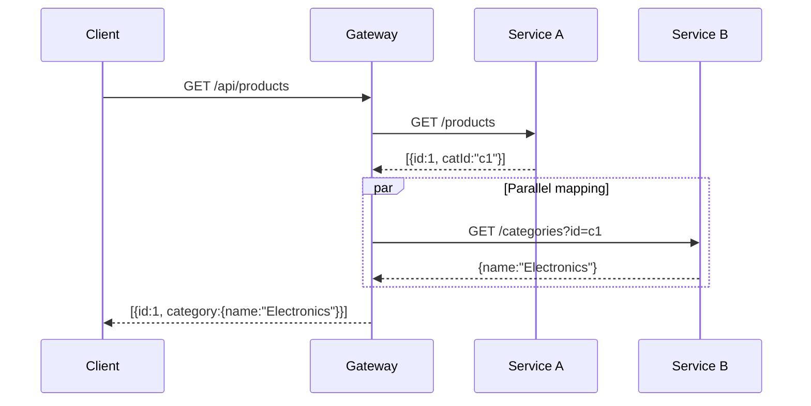

# Response Mapping

Response mapping lets you enrich API responses by fetching related data from other services. The gateway aggregates data from multiple sources into a single response — so your clients make one request instead of many.

## How It Works

When a route has `mapping` rules, the gateway:

1. Fetches the response from the primary backend
2. For each item in the response, extracts parameter values
3. Makes parallel requests to mapped services using those values
4. Merges the mapped data into each response item
5. Returns the enriched response to the client



## Configuration

```yaml
routes:
  - method: GET
    route: /products
    service: localhost:3000
    path: /products
    mapping:
      - path: /categories?id={categoryId}   # {categoryId} extracted from each item
        service: localhost:3000
        tag: category                        # Added as item.category
        removeKeyMapping: true               # Remove categoryId from response
```

### Mapping Fields

| Field | Description |
|-------|-------------|
| `path` | Endpoint to call. `{param}` is replaced with the value from the response item |
| `service` | Host of the service to call |
| `tag` | Key name under which the mapped data is added to the response |
| `removeKeyMapping` | If `true`, removes the original parameter key from the item |

## Examples

### Basic: Posts with comments

Backend returns posts, gateway enriches each post with its comments:

```yaml
routes:
  - method: GET
    route: /posts
    service: localhost:3000
    path: /posts
    mapping:
      - path: /comments?postId={id}
        service: localhost:3000
        tag: comments
        removeKeyMapping: false
```

**Before mapping:**
```json
[
  {"id": "1", "title": "Hello World"},
  {"id": "2", "title": "Another Post"}
]
```

**After mapping:**
```json
[
  {
    "id": "1",
    "title": "Hello World",
    "comments": [
      {"id": "1", "text": "Great post!", "postId": "1"}
    ]
  },
  {
    "id": "2",
    "title": "Another Post",
    "comments": [
      {"id": "2", "text": "Nice!", "postId": "2"}
    ]
  }
]
```

### With removeKeyMapping

Remove the foreign key after mapping:

```yaml
mapping:
  - path: /users/{userId}
    service: localhost:3000
    tag: author
    removeKeyMapping: true
```

**Before:** `{"id": "1", "title": "Post", "userId": "5"}`

**After:** `{"id": "1", "title": "Post", "author": {"name": "Alice"}}`

Note: `userId` is removed from the response.

### Multiple mappings

Enrich with data from multiple services:

```yaml
routes:
  - method: GET
    route: /products
    service: product-service:3000
    path: /products
    mapping:
      - path: /categories/{categoryId}
        service: catalog-service:3001
        tag: category
        removeKeyMapping: true
      - path: /reviews?productId={id}
        service: review-service:3002
        tag: reviews
        removeKeyMapping: false
```

### Single object response

Mapping works with both arrays and single objects:

```yaml
routes:
  - method: GET
    route: /users/{userId}
    service: localhost:3000
    path: /users/{userId}
    mapping:
      - path: /orders?userId={id}
        service: localhost:3000
        tag: orders
        removeKeyMapping: false
```

**Response:**
```json
{
  "id": "1",
  "name": "Alice",
  "orders": [
    {"id": "1", "product": "Laptop", "status": "shipped"}
  ]
}
```

## How Parameters Are Extracted

The `{param}` in the mapping path refers to a key in each response item:

```yaml
path: /comments?postId={id}
#                         ↑
#                    Looks for "id" in each item
```

Given response item `{"id": "1", "title": "Post"}`, the gateway calls `/comments?postId=1`.

## Performance

- All mapping requests for a single item run **in parallel** using goroutines
- Multiple items are also processed concurrently
- If a mapping request fails, the item is returned without that mapping (no error to the client)
- Failed mappings are logged server-side
