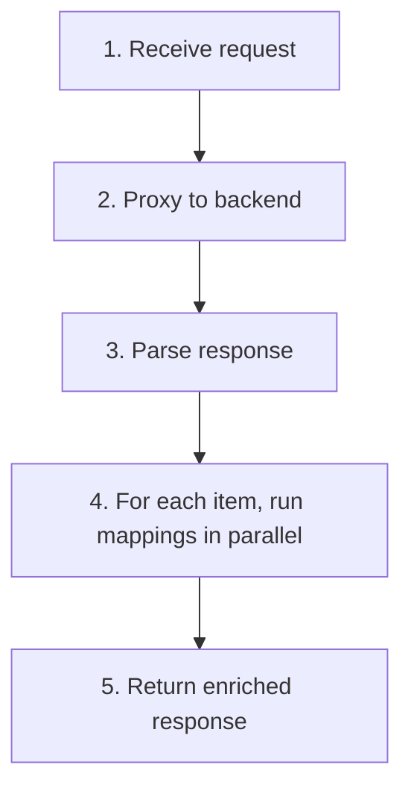
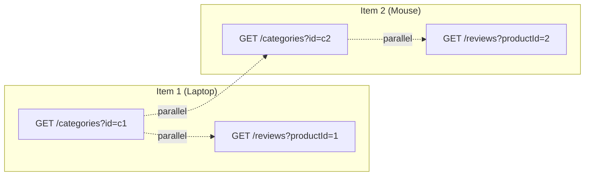

# How Response Mapping Works

## The Flow

When a request hits a route with mapping rules, the gateway does 5 things:



### Step 1: Receive Request

The client calls the gateway route like any normal API:

```
GET /api/products
```

### Step 2: Proxy to Backend

The gateway forwards the request to the configured backend service and captures the response:

```
Gateway → GET http://product-service:3000/products
         ← [{id:"1", name:"Laptop", categoryId:"c1"}, ...]
```

### Step 3: Parse Response

The gateway parses the JSON response. It works with both:
- **Arrays** — `[{...}, {...}, ...]`
- **Single objects** — `{...}`

### Step 4: Run Mappings in Parallel

For each item in the response, the gateway looks at the mapping rules:

```yaml
mapping:
  - path: /categories?id={categoryId}
    service: catalog-service:3000
    tag: category
```

It extracts `{categoryId}` from the item (e.g., `"c1"`), builds the URL, and fetches the data. **All mappings for all items run concurrently:**



### Step 5: Return Enriched Response

Each mapping result is added to the item under the `tag` key. If `removeKeyMapping` is true, the original foreign key is deleted:

```json
{
  "id": "1",
  "name": "Laptop",
  "category": {"name": "Electronics"},
  "reviews": [{"rating": 5, "text": "Great!"}]
}
```

## Parameter Extraction

The `{param}` in the mapping path tells the gateway which field to extract from each item:

```yaml
path: /comments?postId={id}
#                         ↑
#              Looks for the "id" field in each response item
```

Given this item: `{"id": "42", "title": "My Post"}`, the gateway calls:

```
GET /comments?postId=42
```

The parameter can be in the path or query string:

```yaml
# Query parameter
path: /comments?postId={id}     → /comments?postId=42

# Path parameter
path: /users/{authorId}         → /users/7
```

## Error Handling

Mapping is **resilient by design**:

- If a mapping request **fails** (timeout, 500, connection refused), the item is returned **without that mapping** — no error to the client
- Failed mappings are **logged** server-side for debugging
- Other mappings for the same item **continue** — one failure doesn't block the rest
- The primary response is **always returned**, even if all mappings fail

## Concurrency

The gateway uses Go goroutines for parallel execution:

- Each `(item, mapping)` pair runs in its own goroutine
- A mutex per item prevents race conditions on concurrent writes
- HTTP connections are pooled (64 idle connections per host) for high throughput
- With mapping cache enabled, repeated URLs return instantly from memory

## Mapping Cache

When `mappingCache` is enabled, the gateway caches mapping responses by URL. If multiple items share the same `categoryId`, the category is fetched once:

```
Item 1: categoryId="c1" → fetches /categories?id=c1, caches result
Item 2: categoryId="c1" → cache hit, no HTTP call
Item 3: categoryId="c2" → fetches /categories?id=c2, caches result
```

See [Resilience](/docs/resilience) for cache configuration.
