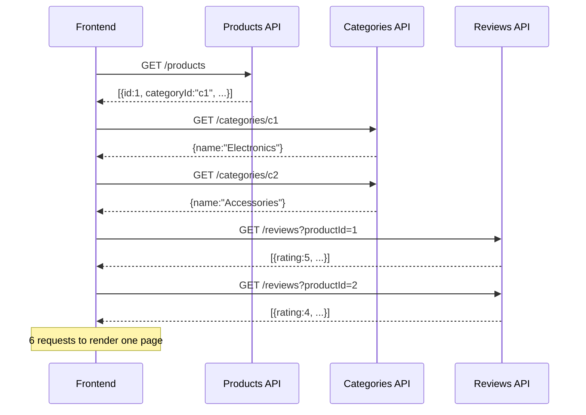
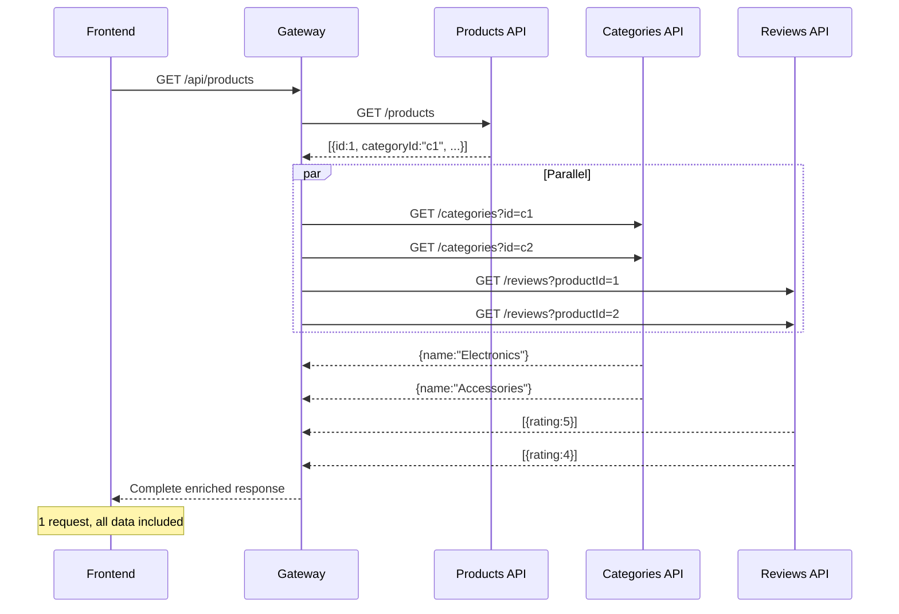

# Response Mapping

## The Problem

In a microservices architecture, data is spread across multiple services. A single page on your frontend might need data from 3 or 4 services to render. Without an API gateway, your frontend has to do this:



This creates problems:
- **Slow** — sequential requests add up. 6 requests at 50ms each = 300ms minimum
- **Complex frontend** — your app needs to orchestrate multiple calls, handle partial failures, merge data
- **Over-fetching** — every client (web, mobile, CLI) repeats the same aggregation logic
- **Chatty network** — especially bad on mobile networks with high latency

## The Solution

Response mapping moves the aggregation logic into the gateway. Your frontend makes **one request**, and the gateway fetches and merges everything:



**Benefits:**
- **One request** — frontend gets everything in a single call
- **Parallel** — all mapping requests run concurrently, so total time = slowest mapping
- **Simple frontend** — no orchestration logic, just render the data
- **Cacheable** — mapping cache avoids refetching data that doesn't change
- **Resilient** — if a mapping fails, the item is returned without it (no error to the client)

## How It Looks

A product list without mapping:

```json
[
  {"id": "1", "name": "Laptop", "categoryId": "c1", "price": 2500},
  {"id": "2", "name": "Mouse", "categoryId": "c2", "price": 49}
]
```

The same product list with mapping (category enriched, foreign key removed):

```json
[
  {
    "id": "1",
    "name": "Laptop",
    "price": 2500,
    "category": {"id": "c1", "name": "Electronics", "description": "Electronic devices"}
  },
  {
    "id": "2",
    "name": "Mouse",
    "price": 49,
    "category": {"id": "c2", "name": "Accessories", "description": "Computer accessories"}
  }
]
```

The `categoryId` foreign key is gone and replaced with the full category object. One request, complete data.

## Next Steps

- [How It Works](/docs/response-mapping/how-it-works) — understand the mechanics step by step
- [Configuration](/docs/response-mapping/configuration) — YAML reference and field descriptions
- [Examples](/docs/response-mapping/examples) — real-world patterns and use cases
