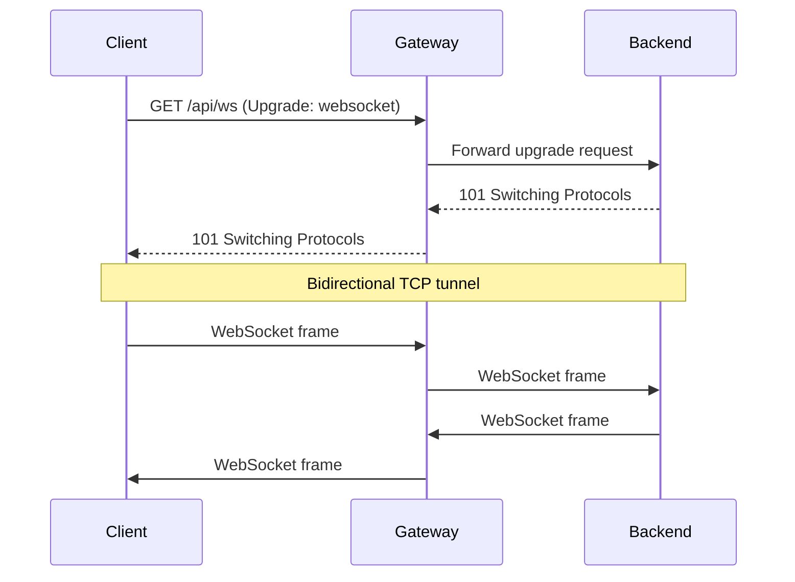

# WebSocket Support

Tainha proxies WebSocket connections to backend services. When a route is marked as `isWebSocket: true`, the gateway handles the HTTP upgrade and establishes a bidirectional TCP tunnel.

## Configuration

```yaml
routes:
  - method: GET
    route: /ws
    service: localhost:3001
    path: /ws
    isWebSocket: true
    public: true
```

## How It Works



1. Client sends an HTTP request with `Upgrade: websocket`
2. Gateway hijacks the connection and connects to the backend
3. Original upgrade request is forwarded to the backend
4. Bytes are piped bidirectionally until either side closes

## Authentication

WebSocket routes support authentication. The token is validated during the HTTP upgrade — before the WebSocket connection is established.

```yaml
routes:
  - method: GET
    route: /ws/chat
    service: localhost:3001
    path: /chat
    isWebSocket: true
    # public: false → requires auth token in upgrade request
```

The client sends the JWT in the initial upgrade request:

```javascript
const ws = new WebSocket('ws://gateway:8000/api/ws/chat', [], {
  headers: { 'Authorization': 'Bearer <token>' }
});
```

## Differences from SSE

| | WebSocket | SSE |
|---|---|---|
| Direction | Bidirectional | Server → Client only |
| Protocol | WebSocket (TCP tunnel) | HTTP (text/event-stream) |
| Config | `isWebSocket: true` | `isSSE: true` |
| Response mapping | Not supported | Not supported |
| Use case | Chat, games, real-time collaboration | Notifications, feeds, dashboards |
